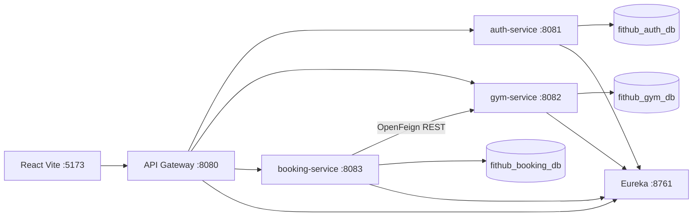

# FitHub Architecture

## Overview

FitHub foloseste o arhitectura cu trei microservicii business si doua componente tehnice Spring Cloud.

## Routing

React apeleaza API Gateway, nu microserviciile direct.

- `/api/auth/**`, `/api/users/**`, `/api/roles/**` -> `auth-service`
- `/api/locations/**`, `/api/rooms/**`, `/api/trainers/**`, `/api/class-types/**`, `/api/classes/**`, `/api/equipment/**` -> `gym-service`
- `/api/clients/**`, `/api/subscription-types/**`, `/api/subscriptions/**`, `/api/bookings/**`, `/api/payments/**`, `/api/notifications/**` -> `booking-service`

## Security

- `auth-service` emite JWT semnat HMAC-SHA256.
- `api-gateway`, `gym-service` si `booking-service` valideaza acelasi JWT.
- Roluri: `ADMIN`, `USER`.
- Endpoint-urile administrative cer `ADMIN`.
- Fluxurile de utilizator cer `USER` sau `ADMIN`.

## Inter-Service Communication

`booking-service` foloseste OpenFeign pentru:
- `GET /api/classes/{id}/availability`
- `POST /api/classes/{id}/reserve-slot`
- `POST /api/classes/{id}/release-slot`

Headerul `Authorization` este propagat catre `gym-service`, astfel incat securitatea distribuita ramane activa.

Feign foloseste numele logic `gym-service`, iar instantele sunt rezolvate prin Eureka si Spring Cloud LoadBalancer. In demo, ruta de rezervare este proba principala ca exista comunicare reala intre microservicii.

## Observability

Fiecare serviciu expune Actuator health:
- `/actuator/health`

Eureka arata instantele inregistrate si demonstreaza service discovery.

Swagger/OpenAPI este activ pentru serviciile business:
- `http://localhost:8081/swagger-ui.html`
- `http://localhost:8082/swagger-ui.html`
- `http://localhost:8083/swagger-ui.html`
