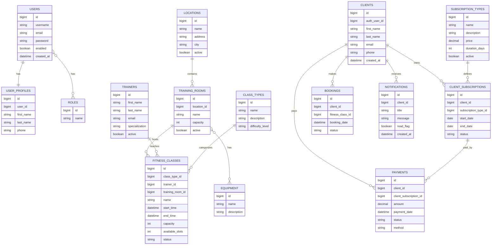

# ER Diagram

```mermaid
erDiagram
    USERS ||--|| USER_PROFILES : has
    USERS }o--o{ ROLES : has

    LOCATIONS ||--o{ TRAINING_ROOMS : contains
    TRAINING_ROOMS ||--o{ FITNESS_CLASSES : hosts
    TRAINERS ||--o{ FITNESS_CLASSES : teaches
    CLASS_TYPES ||--o{ FITNESS_CLASSES : categorizes
    TRAINING_ROOMS }o--o{ EQUIPMENT : has

    CLIENTS ||--o{ CLIENT_SUBSCRIPTIONS : owns
    SUBSCRIPTION_TYPES ||--o{ CLIENT_SUBSCRIPTIONS : defines
    CLIENTS ||--o{ BOOKINGS : makes
    CLIENTS ||--o{ PAYMENTS : pays
    CLIENT_SUBSCRIPTIONS ||--o{ PAYMENTS : paid_by
    CLIENTS ||--o{ NOTIFICATIONS : receives

    USERS {
        bigint id
        string username
        string email
        string password
        boolean enabled
        datetime created_at
    }

    USER_PROFILES {
        bigint id
        bigint user_id
        string first_name
        string last_name
        string phone
    }

    ROLES {
        bigint id
        string name
    }

    LOCATIONS {
        bigint id
        string name
        string address
        string city
        boolean active
    }

    TRAINING_ROOMS {
        bigint id
        bigint location_id
        string name
        int capacity
        boolean active
    }

    TRAINERS {
        bigint id
        string first_name
        string last_name
        string email
        string specialization
        boolean active
    }

    CLASS_TYPES {
        bigint id
        string name
        string description
        string difficulty_level
    }

    FITNESS_CLASSES {
        bigint id
        bigint class_type_id
        bigint trainer_id
        bigint training_room_id
        string name
        datetime start_time
        datetime end_time
        int capacity
        int available_slots
        string status
    }

    EQUIPMENT {
        bigint id
        string name
        string description
    }

    CLIENTS {
        bigint id
        bigint auth_user_id
        string first_name
        string last_name
        string email
        string phone
        datetime created_at
    }

    SUBSCRIPTION_TYPES {
        bigint id
        string name
        string description
        decimal price
        int duration_days
        boolean active
    }

    CLIENT_SUBSCRIPTIONS {
        bigint id
        bigint client_id
        bigint subscription_type_id
        date start_date
        date end_date
        string status
    }

    BOOKINGS {
        bigint id
        bigint client_id
        bigint fitness_class_id
        datetime booking_date
        string status
    }

    PAYMENTS {
        bigint id
        bigint client_id
        bigint client_subscription_id
        decimal amount
        datetime payment_date
        string status
        string method
    }

    NOTIFICATIONS {
        bigint id
        bigint client_id
        string title
        string message
        boolean read_flag
        datetime created_at
    }
```

`bookings.fitness_class_id` este ID extern catre `gym-service`, fara foreign key intre baze diferite.
